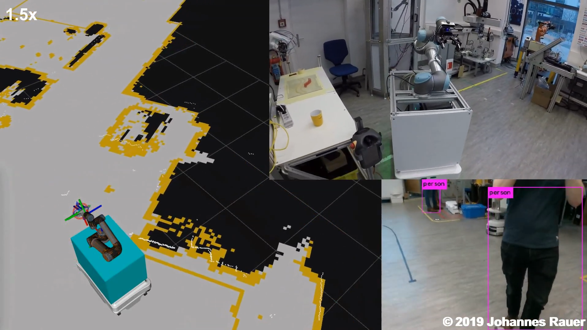

# Controlling UR5 and MiR100 via ROS
This repository provides the program code to the paper [An Autonomous Mobile Handling Robot Using Object Recognition](An%20Autonomous%20Mobile%20Handling%20Robot%20Using%20Object%20Recognition.pdf). It can be used to control a UR5 articulated robot mounted to a MiR100 mobile robot, equipped with a Realsense D435 RGB-D-camera and the parallel-jaw gripper Robotiq 2F-85 via ROS. This mobile manipulator ("Butler") is able to drive flexible paths, localize predefined objects and grasp them using an out-of-the-box neural network for object detection and hand-crafted methods for extracting grasp-points from depth images to avoid cumbersome grasp-point-annotated training data.
For further explanations watch the [video](https://www.youtube.com/watch?v=mol4nazCb9g) or read the [manual](Butler_Bedienungsanleitung_v1-1.pdf).

### How to cite this work
Rauer J., Wöber W., and Aburaia M. "An Autonomous Mobile Handling Robot Using Object Recognition", Proceedings of the ARW & OAGM Workshop 2019

### Necessary software ###
Run InstallationsSkript.sh to install all necessary packages.
- **butler** (including mir_robot, universal_robot, ur_modern_driver)
- **websocket** (python) for communication with MiR
- **moveit** to control UR5
- **socket** (python) for communication with Gripper
- **librealsense2** and **pyrealsense2** (python) for communication with Camera
- **darknet_ros** for object-detection
- **ntpdate** to sync the times between ROS-Cores

### Change and add goals ###
- Open `~/catkin_ws/src/butler/src/mission_control/mission_control.py`
- In function createGoal add a new elif with your goal parameters
  - Set a name
  - Get the MiR-Goal from the web-interface by clicking a position in the map
  - Measure the table or platform height
  - Add the orientation the UR should turn to search / put-down the object

### Run Butler-Robot ###
1. Check connections as mentioned in Butler_Bedienungsanleitung_v1-1.pdf
2. Synchronise times
`bash ~/catkin_ws/src/butler/syncTime.sh`
3. Start basic nodes
`bash ~/catkin_ws/src/butler/launch/run_real_butler.bash`
4. Start task-execution
`rosrun butler robot_control pickUpGoalName putDownGoalName objectToSearch`
  - Use goalNames given in mission_control.py
  - objectToSearch for must be cup or bottle
